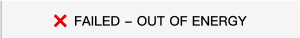

# 如何解决“OUT OF ENERGY"错误
在使用波场（TRON）网络进行 TRC20 合约调用（如转账 USDT）时，不少用户可能遇到过这样的提示：

这是一种非常常见的错误提示，意味着你此次合约调用所需的能量（Energy）不足。本文将深入剖析这个问题的成因以及快速有效的解决办法。
## 常见原因分析：
1. **能量不足**：每次 TRC20 合约调用都需要消耗一定的能量，如果你的账户没有足够的能量，就会出现这个错误。
2. **能量价格过高**：如果你设置的能量价格过高，可能会导致实际消耗的能量超过你的账户余额，从而触发这个错误。
3. **网络拥堵**：在网络拥堵时，能量消耗可能会增加，导致你原本足够的能量变得不足。
## 解决办法：
1. **购买能量**：你可以通过波场钱包购买能量，确保你的账户有足够的能量来完成合约调用。
2. **调整能量价格**：尝试降低能量价格，看看是否能够成功调用合约。
3. **等待网络恢复**：如果是由于网络拥堵导致的能量不足，建议等待网络恢复后再尝试调用合约。
4. **使用能量租赁**：一些平台提供能量租赁服务，你可以租赁能量来完成合约调用，而不需要自己购买。
## 结语
遇到“OUT OF ENERGY"错误时，不要慌张，按照上述方法逐步排查和解决，通常都能顺利完成你的 TRC20 合约调用。如果问题依然存在，建议联系波场官方客服或社区寻求帮助，他们通常会提供更具体的解决方案。

